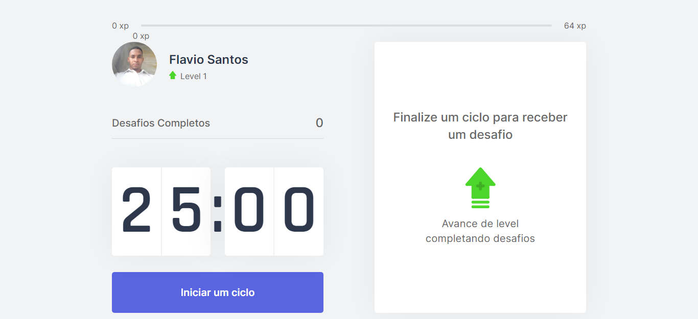

<div align="center"></div>

<div id='about'>
  <h1 align="center">
	Move it 🚀
  </h1>
  <p align="center">
	  🚀 It's an application that manage the time between work and rest, and helps the user to stay focused.
  <p>
    This is a [Next.js](https://nextjs.org/) project bootstrapped with [`create-next-app`](https://github.com/vercel/next.js/tree/canary/packages/create-next-app).
  </p>
</div>

Tabela de conteúdos
=================
<!--ts-->
   * [About](#about)
   * [How to run](#how-to-run)
      * [Requirements](#requirements)
   * [Tecnologies](#technologies)
<!--te-->

## Getting Started

<div id='hot-to-run'>
  <h2>How to run</h2>

  <div id='requirements' display='flex' flex-direction='column'>
    <h3>To run this application you need to install:</h3>
    - [NodeJS](https://nodejs.org/)<br/>
    - [Git](https://git-scm.com/)<br/>
    - Além disto é bom ter um editor para trabalhar com o código como [VSCode](https://code.visualstudio.com/)
  </div>
  
  <br/>

  First, download this repository to your machine:

  ```bash
  git clone https://github.com/flvSantos15/desafio-07-rckt-chakra-ui.git
  ```
  
  Go to the folder:
  
  ```bash
  cd folder's name
  ```

  Then, install dependencies by running:
  ```bash
  yarn
  # or
  npm install
  ```

  And finally, run the development server:

  ```bash
  npm run dev
  # or
  yarn dev
  ```

  Open [http://localhost:3000](http://localhost:3000) with your browser to see the result.
 </div>

<div id='technologies'>
  <h2>This application is being built using the following technologies:</h2>
  
  - [React](https://pt-br.reactjs.org/)
  - [TypeScript](https://www.typescriptlang.org/)
  - [NextJS](https://nextjs.org/)
  - [Styled Components](https://www.styled-components.com/)
</div>

<div id='features'>
  <h2>Features</h2>

	- [x] Utiliza técnica de polmodoro
	- [x] Inicia/Abandona ciclo de exercicio
	- [x] Avisa com som quando um ciclo encerra
	- [ ] Persiste informaçoes através de cookies
</div>

<div id='author'>
  <h2>Autor</h2>

 
 <br />
 <sub><b>Flavio Santos</b></sub>


Built with ❤️ by Flavio Santos 👋🏽 get in touch!

[](https://www.linkedin.com/in/flvSantos15/) 
[](mailto:flvSantos300@gmail.com)
</div>
